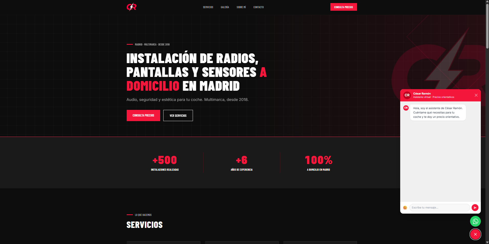
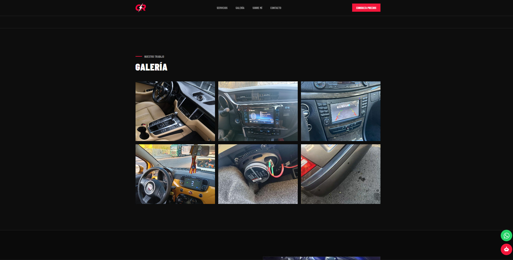

# 🚗 Car Installer AI Web — Asistente Virtual RAG para Negocio Local

Web profesional con asistente de IA integrado para un instalador de audio y accesorios para vehículos en Madrid. El asistente responde automáticamente consultas de precios y servicios 24/7, sin que el propietario tenga que estar pendiente del móvil mientras trabaja.

🌐 **Demo en vivo:** [http://147.79.117.24/](http://147.79.117.24/)

---

## 📸 Vista previa




---

## 🧠 El problema

Un instalador de audio y accesorios para vehículos en Madrid (+500 instalaciones, desde 2018) recibía constantemente las mismas consultas por WhatsApp — precios, disponibilidad, servicios — mientras trabajaba en los coches. Necesitaba una solución que respondiera automáticamente a sus clientes con información real y precisa, sin alucinaciones ni respuestas genéricas.

## ✅ La solución

Web profesional con asistente de IA embebido basado en arquitectura **RAG (Retrieval-Augmented Generation)** — el asistente responde exclusivamente basándose en la base de conocimiento del negocio, garantizando precisión y coherencia en cada respuesta.

---

## ⚙️ Arquitectura

```
Cliente → React 18 (Netlify/VPS)
           ↓
        FastAPI (Railway/VPS)
           ↓
        LangChain Agent
           ↓
     ChromaDB (Vector Store)
     HuggingFace Embeddings
           ↓
     Claude Haiku (OpenRouter API)
           ↓
        Respuesta al cliente
```

---

## 🛠️ Stack técnico

| Capa | Tecnología |
|---|---|
| Frontend | React 18 + Tailwind CSS |
| Backend | FastAPI + Python |
| Orquestación IA | LangChain |
| Base vectorial | ChromaDB |
| Embeddings | HuggingFace `paraphrase-multilingual-MiniLM-L12-v2` |
| LLM | Claude Haiku vía OpenRouter API |
| Despliegue | VPS propio con Dokploy |

---

## 🚀 Características principales

- **RAG end-to-end** — pipeline completo de ingesta, embeddings, recuperación semántica y generación
- **Embeddings multilingües** — búsqueda semántica independientemente de cómo formule la pregunta el usuario
- **Sin alucinaciones** — el asistente responde solo con información del negocio o indica que no tiene esa información
- **Chat embebido** — integrado directamente en la web, sin redirigir a plataformas externas
- **Despliegue en VPS propio** con Dokploy para disponibilidad continua

---

## 📁 Estructura del proyecto

```
car-installer-ai-web/
├── frontend/          # React 18 + Tailwind CSS
│   ├── src/
│   │   ├── components/
│   │   └── App.jsx
│   └── package.json
├── backend/           # FastAPI + LangChain
│   ├── main.py
│   ├── rag/
│   │   ├── ingest.py      # Carga y procesamiento de documentos
│   │   ├── retriever.py   # ChromaDB + embeddings
│   │   └── chain.py       # LangChain agent
│   └── requirements.txt
└── assets/            # Capturas de pantalla
```

---

## 🔧 Instalación local

### Requisitos
- Python 3.10+
- Node.js 18+
- API key de OpenRouter

### Backend
```bash
cd backend
pip install -r requirements.txt
uvicorn main:app --reload
```

### Frontend
```bash
cd frontend
npm install
npm run dev
```

### Variables de entorno
```env
OPENROUTER_API_KEY=tu_api_key
```

---

## 👤 Autor

**Marcos Carbajo Echalecu** — AI Engineer & Automation Specialist

[](https://linkedin.com/in/marcos-carbajo)
[](https://github.com/MarcosCarbajoEchalecu)
[](https://marcoscarbajoechalecu.github.io/Portfolio/)
